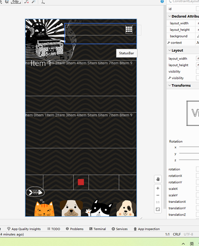

# 一个节拍器

为了完成安卓大作业而制作的项目，包括安卓的四大组件，手机传感器的调用。作业相关文档在notion里，下面为添加的功能的简介。

# 震动传感器 震动功能

初始化震动传感器

音频推流时，调用震动传感器

 

# Activity 主页面

只有一个，也就是主界面

 

 

#  

# BroadcastReceiver 夜间模式功能

用BroadcastReceiver实现夜间模式

首先在manifest声明receiver

静态注册广播接收器，监听系统配置是否变化

创捷MyReceiver类，用于监看系统设置变化，并创建接收器，方便主activity调用

 

在MetronomeActivity（主界面）初始化，动态注册广播接收器，并将listener绑定到MyReceiver中的接口 

 

在MetronomeActivity（主界面）中实现接口，当接收到receiver的信号时，重新创建画布。

 

在MetronomeActivity（主界面），在onCreate(创建画布)时，系统会自动判断当前是否为深色模式。

如果为深色则创建暗色画布，否则创建亮色。

 

# Content provider 保存预设以及使用预设功能

保存预设和使用预设功能: 保存bpm和sound类型

首先在manifest声明provider

****

新建myProvider类继承自Content provider

 

保存预设和使用预测分别调用MetronomeActivity（主界面）的saveSetting和useSetting函数，通过MyProvider中获取provider提供的数据来保存和设置界面。

在myProvider内建立数据库类DatabaseHelper，建立一个数据库和一张表(如果不存在)

每次保存和使用预设会更新这张表

| _id  | bpm  | sound   |
| ---- | ---- | ------- |
| 1    | 120  | Default |

 

# Service 自动后台播放功能

利用前后台切换检测，在进入后台时自动播放，进入前台时停止。

首先在manifest中注册service

创建backStageService类，包括启动后台播放功能，和停止后台播放功能。

新建AppFrontBackHelper类，通过实现Application.ActivityLifecycleCallbacks

接口来完成监听前后台切换功能。

在主页面实例化该类，并实现onFront，onBack接口，实现监听前后台功能，并在前后台切换时调用用于后台播放的service。

 

# 源自项目

[Releases · LaoQi/SimpleBeat (github.com)](https://github.com/LaoQi/SimpleBeat/releases)